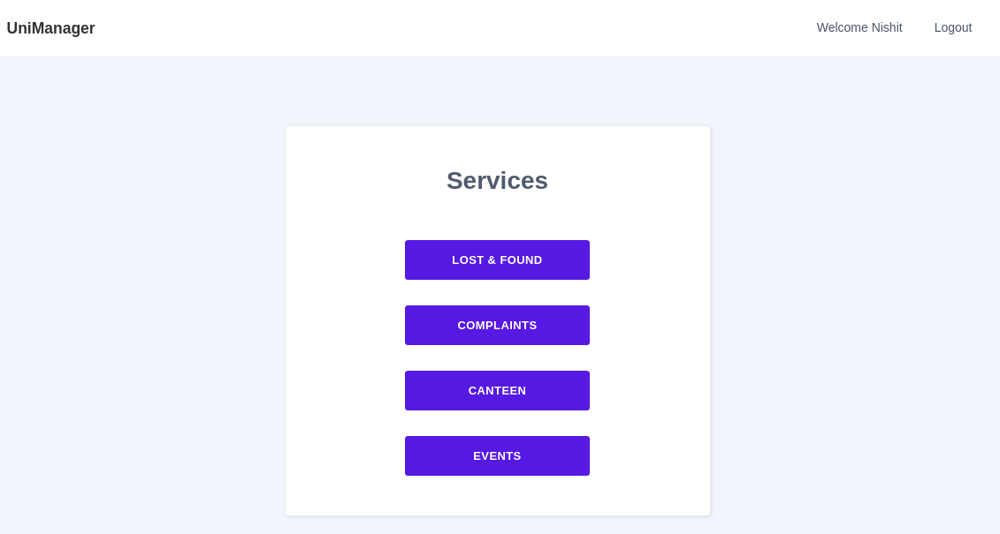
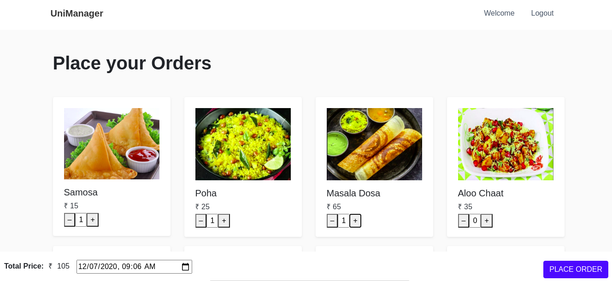
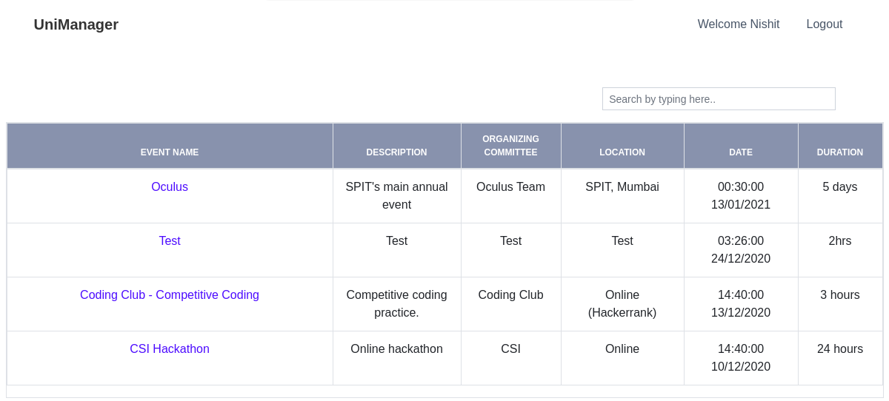
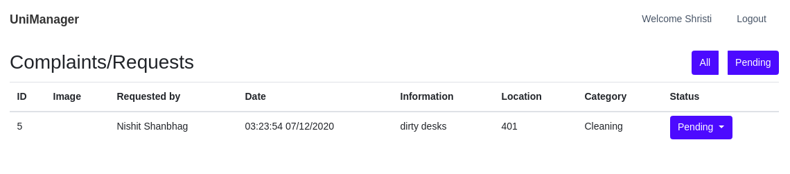
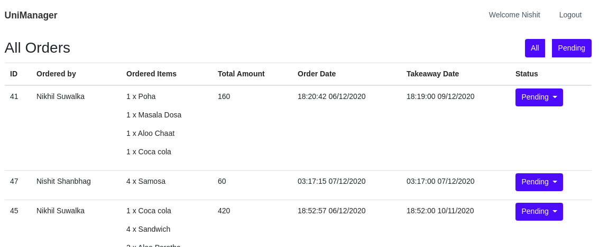
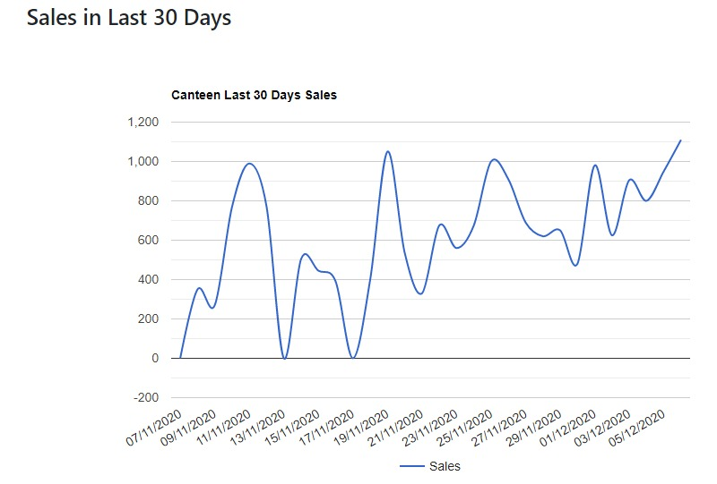
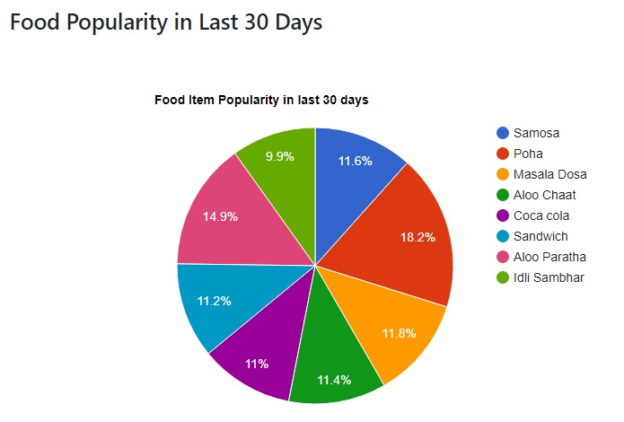
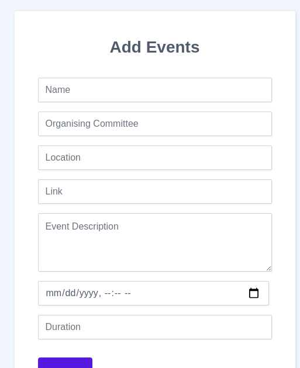

# 

All in one app where we can access smart
university services like complaints related to university, lost & found, canteen orders,
event notifications.

## Maintainers
[Nishit Shanbhag](https://github.com/nishit-shanbhag/) 
[Nikhil Suwalka](https://github.com/nikhil-suwalka/)  
[Amar Gurav](https://github.com/amargurav1495/) 
[Shristi Bisht](https://github.com/ShristiBisht/)

## Why?
To provide bettter platform for students to use different services present in university premises. It also provides staff a way to store the data and use it to improve their services. 

## How?
An User Friendly Web application for using different services which are present in university premises like canteen, lost and found, complaint box. 
It also notifies students about ongoing and upcoming events in college.

### Salient features :book:
* Order food/snacks on desired time. It also provides the canteen with the past data and also generates various graphs. 
* Browse the list of items submitted to lost & found department and claim your own.  
* Report any issue in university in different categories like **Cleanliness, Examination, Infrastructure, etc** along with images.  
* Browse different ongoing and upcoming events in university premises.  

## Tech Stack
* Django
* JavaScript
* SQLite

## How to use this application
1. Login/Register on the portal, you will be redirected to the home pages where you will be able to view all the services.
# 
2. Using Services(Users)
  * Lost and Found - view all reported items and report lost items.
  # 
  # 
  * Complaints / Requests - register a complaint / request 
  # 
  * Canteen - view your orders and order food with takeaway date and time.
  # 
  # 
  * Events - view upcoming events
  # 
 3. Providing / Monitoring Services(Admin)
  * Lost and Found - view all reported items and change status and description.
  # 
  # 
  * Complaints / Requests - View all requests and change the status.
  # 
  * Canteen - view all pending orders and change status, view sales and popularity reports.
  # 
  # 
  # 
  * Events - Create and view upcoming events.
  # 
  
  
